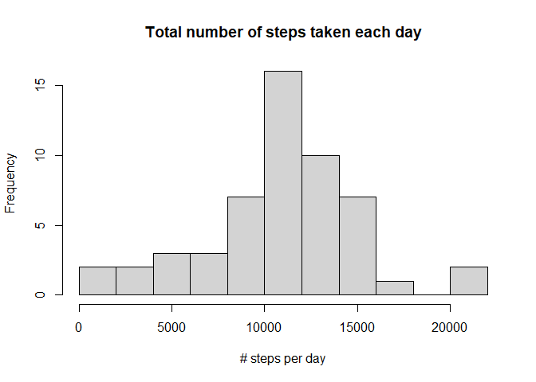
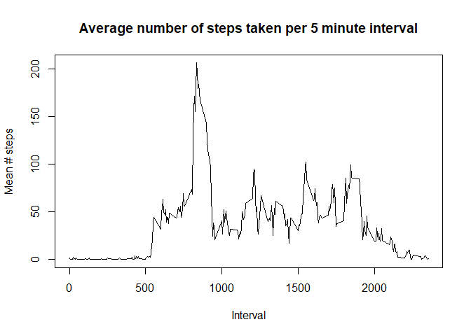
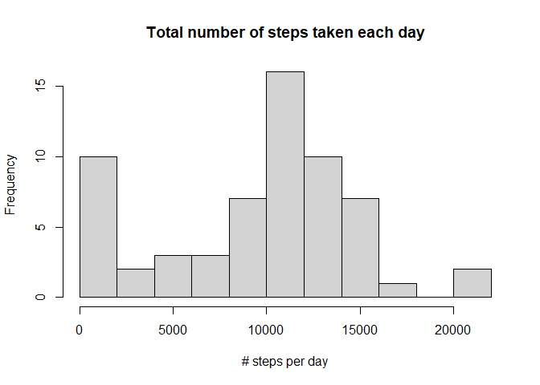
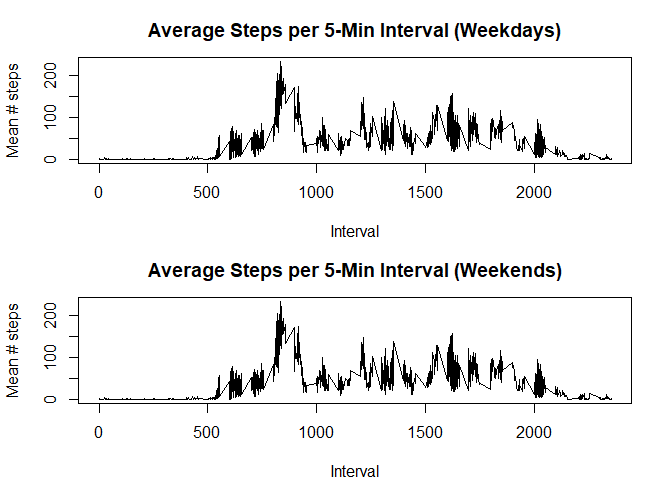
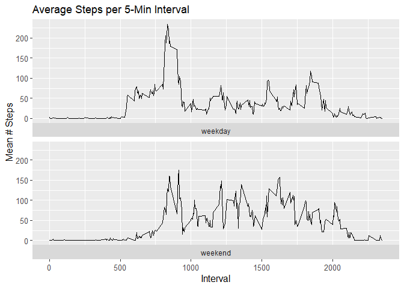

## Loading and preprocessing the data


``` r
# Load Libraries
library(tidyverse)
library(lubridate)

# Load the data
data <- read.csv("activity.csv")

# Process/Transform the data
data$date <- as_date(data$date)

head(data)
```

```
##   steps       date interval
## 1    NA 2012-10-01        0
## 2    NA 2012-10-01        5
## 3    NA 2012-10-01       10
## 4    NA 2012-10-01       15
## 5    NA 2012-10-01       20
## 6    NA 2012-10-01       25
```

------------------------------------------------------------------------

## What is mean total number of steps taken per day?

For this part of the assignment, you can ignore the missing values in the dataset.\
- Make a histogram of the total number of steps taken each day\
- Calculate and report the mean and median total number of steps taken per day


``` r
df <- data %>% filter(!is.na(steps)) # remove NA values

# Calculate the total number of steps taken per day
df <- df %>%
  group_by(date) %>%
  summarise(steps_per_day = sum(steps, na.rm = TRUE), .groups = "drop")

# Calculate the mean and median of the total number of steps taken per day
mean <- mean(df$steps_per_day)
median <- median(df$steps_per_day)

head(df)
```

```
## # A tibble: 6 × 2
##   date       steps_per_day
##   <date>             <int>
## 1 2012-10-02           126
## 2 2012-10-03         11352
## 3 2012-10-04         12116
## 4 2012-10-05         13294
## 5 2012-10-06         15420
## 6 2012-10-07         11015
```

``` r
# Make a histogram of the total number of steps taken each day
hist(df$steps_per_day,
  main = "Total number of steps taken each day",
  xlab = "# steps per day",
  breaks = 10
)
```

<!-- -->

**Mean** total number of steps taken per day: **10766.19**\
**Median** total number of steps taken per day: **10765**

------------------------------------------------------------------------

## What is the average daily activity pattern?

-   Make a time series plot of the 5-minute interval (x-axis) and the average number of steps taken, averaged across all days (y-axis)\
-   Which 5-minute interval, on average across all the days in the dataset, contains the maximum number of steps?\


``` r
df <- data %>% filter(!is.na(steps)) # remove NA values

# Get average steps per interval
df <- df %>%
  group_by(interval) %>%
  summarise(mean_steps = mean(steps, na.rm = TRUE), .groups = "drop")

# time series plot
plot(df$interval, df$mean_steps,
  type = "l",
  main = "Average number of steps taken per 5 minute interval",
  xlab = "Interval",
  ylab = "Mean # steps"
)
```

<!-- -->

``` r
max_steps <- df$interval[which.max(df$mean_steps)]
```

The **maximum** average number of steps is found in **interval 835**

------------------------------------------------------------------------

## Imputing missing values

Note that there are a number of days/intervals where there are missing values (coded as NA). The presence of missing days may introduce bias into some calculations or summaries of the data.

-   Calculate and report the total number of missing values in the dataset
-   Devise a strategy for filling in all of the missing values in the dataset.
-   Create a new dataset that is equal to the original dataset but with the missing data filled in.\
-   Make a histogram of the total number of steps taken each day\
-   Calculate and report the mean and median total number of steps taken per day.\
-   Do these values differ from the estimates from the first part of the assignment?\
-   What is the impact of imputing missing data on the estimates of the total daily number of steps?


``` r
# Calculate the total number of missing values in the dataset
count_na <- sum(is.na(data$steps))
count_all <- nrow(data)
missing_perc <- (count_na / count_all) * 100
```

There are **2304** missing values in the data set. This represents **13%** of the total values.


``` r
# Devise a strategy for filling in all of the missing values in the dataset.
# Calculate median per interval and use that to replace NAs
# Create a new dataset that is equal to the original dataset but with the missing data filled in.

df <- data %>%
  group_by(interval) %>%
  mutate(steps = ifelse(is.na(steps), median(steps, na.rm = TRUE), steps)) %>%
  ungroup()

head(df)
```

```
## # A tibble: 6 × 3
##   steps date       interval
##   <int> <date>        <int>
## 1     0 2012-10-01        0
## 2     0 2012-10-01        5
## 3     0 2012-10-01       10
## 4     0 2012-10-01       15
## 5     0 2012-10-01       20
## 6     0 2012-10-01       25
```

``` r
# Make a histogram of the total number of steps taken each day
# Get the total number of steps per day
df <- df %>%
  group_by(date) %>%
  summarise(steps_per_day = sum(steps, na.rm = TRUE), .groups = "drop")

hist(df$steps_per_day,
  main = "Total number of steps taken each day",
  xlab = "# steps per day",
  breaks = 10
)
```

<!-- -->

``` r
# Calculate and report the mean and median total number of steps taken per day
mean_imp <- mean(df$steps_per_day)
median_imp <- median(df$steps_per_day)
```

**Mean** total number of steps taken per day: **9503.869**\
**Median** total number of steps taken per day: **10395**

\
These differ from the initial values calculated (Mean: **10766.19**, Median: **10765**). Imputing the missing values in this way has increased both the mean and the median values. 

------------------------------------------------------------------------

## Are there differences in activity patterns between weekdays and weekends?


``` r
# Create a new factor variable in the dataset with two levels – “weekday” and “weekend”
df <- data %>% filter(!is.na(steps)) # remove NA values
df$weekday <- ifelse(weekdays(df$date) %in% c("Monday", "Tuesday", "Wednesday", "Thursday", "Friday"), "weekday", "weekend")

# Make a panel plot containing a time series plot of the 5-minute interval (x-axis) and the average number of steps taken, averaged across all weekday days or weekend days (y-axis).

# Get average steps per interval
df <- df %>%
  group_by(interval, weekday) %>%
  summarise(mean_steps = mean(steps, na.rm = TRUE), .groups = "drop")

# Set plotting area to 2 rows, 1 column
par(mfrow = c(2, 1), mar = c(4, 4.1, 3, 2.1))

# Weekdays
plot(df$interval, df$mean_steps,
  type = "l",
  main = "Average Steps per 5-Min Interval (Weekdays)",
  xlab = "Interval",
  ylab = "Mean # steps"
)

# Weekends
plot(df$interval, df$mean_steps,
  type = "l",
  main = "Average Steps per 5-Min Interval (Weekends)",
  xlab = "Interval",
  ylab = "Mean # steps"
)
```

<!-- -->

``` r
# OR
# ggplot option

ggplot(df, aes(interval, mean_steps)) +
  geom_line() +
  facet_wrap(vars(weekday), nrow = 2, strip.position = "bottom") +
  theme(
    axis.text = element_text(size = 10),
    axis.title = element_text(size = 12)
  ) +
  labs(y = "Mean # Steps") +
  labs(x = "Interval") +
  ggtitle("Average Steps per 5-Min Interval")
```

<!-- -->
